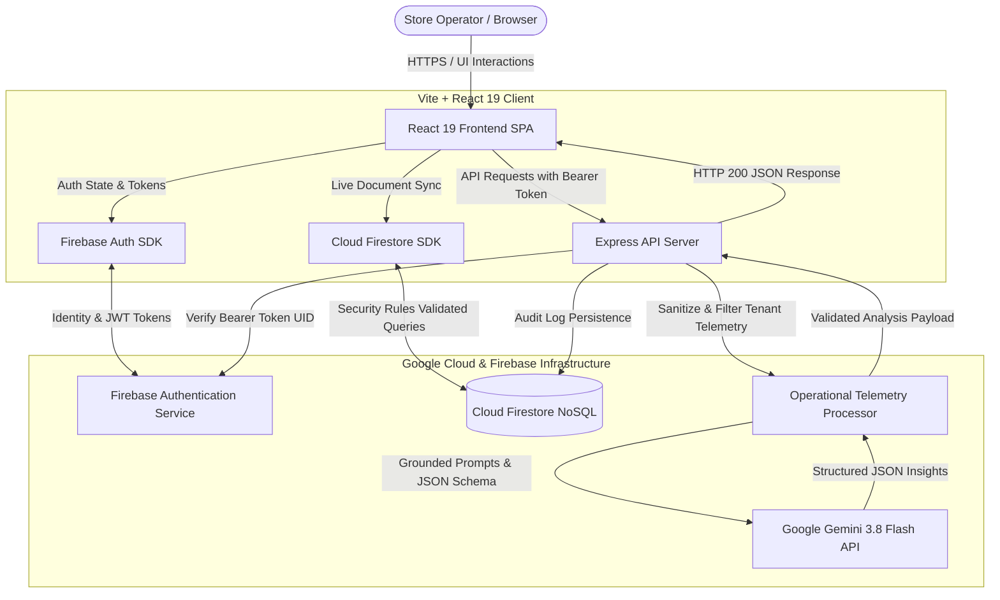

# OpsPilot AI

An AI-powered operational intelligence platform built specifically for small retail and e-commerce operators. OpsPilot AI aggregates sales velocity, inventory levels, customer purchasing patterns, and operating expenses into a unified operational dashboard, combining live telemetry with Google Gemini models to deliver evidence-backed diagnostics, risk identification, and strategic recommendations.

---

## 1. Project Overview

Small retail businesses, e-commerce storefronts, and independent operators generate data every day across multiple systems. Point-of-sale terminals record transactions, inventory sheets log counts, spreadsheets list invoices, and spreadsheets or accounting tools capture monthly bills. Despite generating this data, store owners often lack the time, specialized analytical staff, or unified software to understand how these dimensions interact.

**OpsPilot AI** connects these operational streams into a cohesive workspace backed by Google Cloud Firestore and Firebase Authentication. It runs server-side analytical pipelines powered by Google Gemini to transform raw transactional telemetry into structured operational intelligence: identifying margin leakage, calculating stock depletion timelines against sales velocity, isolating customer churn indicators, and providing actionable remediation plans grounded directly in verified store data.

---

## 2. Key Features

The platform provides a comprehensive suite of business monitoring and AI-driven operational tools:

- **Business Dashboard**: Real-time operational overview tracking total revenue, transaction counts, operating margins, low-stock warnings, and an interactive operational health status grid.
- **Sales Analytics**: Revenue velocity by category and channel (In-Store vs. Online), top-performing items, sales distribution trends, and historical receipt logs.
- **Inventory Monitoring**: Live stock counting, automated stock status classification (`In Stock`, `Low Stock`, `Out of Stock`), depletion run-rate estimates, safety buffer alerts, and one-click restock ordering.
- **Customer Data**: Directory of verified customers with order counts, lifetime spend calculations, account status tags, and last-activity tracking.
- **Expense Tracking**: Categorized overhead logging (Inventory, Rent, Utilities, Marketing, Payroll), fixed vs. variable expense breakdowns, and net operational profit calculations.
- **AI Operations Studio**: Central command hub for running grounded AI analyses, viewing diagnostics, and conducting natural-language business investigations.
- **AI Executive Summary**: Synthesizes revenue performance, order volume trends, and margin health into high-level executive briefs.
- **AI Risk Analysis**: Multi-tier operational risk matrix evaluating critical inventory bottlenecks, margin compression, expense spikes, and customer concentration vulnerabilities.
- **AI Recommendations**: Prioritized, explainable action plans with projected business impacts, implementation timeframes, and difficulty ratings.
- **Ask OpsPilot Natural-Language Analysis**: Direct conversational querying interface allowing operators to ask questions (e.g., *"Why did revenue decline this week?"*, *"Which SKUs should I reorder immediately?"*) and receive structured answers backed by concrete data facts.
- **Analysis History**: Durable, timestamped audit log of all generated AI reports and diagnostic evaluations saved directly to Cloud Firestore.
- **Firebase Authentication**: Secure user identity supporting Email/Password and Google Sign-In with automatic session restoration and route-level protection.
- **Cloud Firestore Persistence**: Reactive NoSQL document database storing tenant profiles, businesses, products, sales, customers, expenses, and AI analyses.
- **Multi-Tenant Data Isolation**: Complete zero-trust boundary where every record is tied to the authenticated user's UID and workspace ID, enforced both in Firestore security rules and backend API middleware.
- **Zero-Data / Insufficient-Data Safety**: Defensive analysis logic that validates data volume before prompting AI models, providing informative guidance when datasets are empty or sparse rather than hallucinating metrics.

---

## 3. Problem Statement

Small and medium-sized business operators face substantial operational challenges:

1. **Fragmented Data Siloes**: POS systems, inventory management, customer tracking, and expense ledgers rarely communicate, obscuring the relationship between stock availability and revenue dips.
2. **Delayed Risk Detection**: Operators often discover inventory depletion only after orders fail, or realize expenses have outpaced revenue weeks after month-end.
3. **Lack of In-House Data Teams**: Enterprise corporations deploy dedicated analytics teams to model margins and forecast demand; small businesses rely on manual spreadsheet calculations or intuition.
4. **Generic AI Hallucinations**: Standard consumer chatbots lack verified access to store databases and produce non-factual, generic business advice that cannot be audited against real ledger records.

---

## 4. Solution

OpsPilot AI addresses these challenges through a unified telemetry architecture:

- **Centralized Operational Telemetry**: Consolidates catalog items, sales orders, customer accounts, and expense entries into a standardized Firestore schema under a single workspace.
- **Deterministic Pre-Aggregation**: Pre-computes key performance indicators (gross revenue, net profit, burn rate, turnover velocity, out-of-stock ratios) directly from verified database records.
- **Grounded Gemini Analysis**: Packages sanitized, tenant-isolated telemetry into structured prompts for Google Gemini models via `@google/genai`, enforcing strict JSON response schemas.
- **Evidence-Based Output**: Requires the AI model to cite specific facts from the provided business context (e.g., product SKUs, exact revenue figures, specific expense items) in its findings.
- **Actionable Decision Support**: Transforms abstract findings into categorized, time-bounded directives that store managers can execute immediately.

---

## 5. Architecture

The application is structured as a full-stack system with a React single-page application (SPA), an Express API gateway, Firebase managed services, and Google Gemini models.



### Component Breakdown
- **User Interface**: React 19 single-page application built with Tailwind CSS, Lucide icons, and Motion, rendered responsively across desktop, tablet, and mobile displays.
- **Authentication**: Firebase Authentication manages user credentials, ID tokens, and session persistence across browser sessions.
- **Database**: Cloud Firestore provides real-time multi-collection storage (`users`, `businesses`, `products`, `sales`, `customers`, `expenses`, `aiAnalyses`) secured by declarative rules.
- **Backend Server**: Node.js Express server (`server.ts`) operating as an API gateway and development middleware server, bundled into CommonJS via `esbuild` for production.
- **AI Processing**: Dedicated backend routes (`/api/ai/*`) validate incoming Firebase Bearer tokens, filter telemetry to ensure tenant isolation, and interface with Google Gemini using the `@google/genai` SDK.

---

## 6. AI Capabilities

OpsPilot AI utilizes Google Gemini 3.8 Flash (with resilient fallback to Gemini 3.1 Flash Lite) to deliver four specialized analytical modes:

### Executive Summary (`/api/ai/executive-summary`)
Generates an operational health briefing that breaks down revenue performance against period benchmarks, evaluates order volume and channel distribution, and diagnoses net estimated profitability based on real expenses.

### Risk Analysis (`/api/ai/risk-analysis`)
Continuously audits business telemetry to compile a categorized risk register. Each risk item is tagged with a severity level (`critical`, `warning`, `info`), category (`inventory`, `sales`, `financial`, `operational`), root-cause explanation, and direct impact statement.

### Actionable Recommendations (`/api/ai/recommendations`)
Produces a prioritized action roadmap detailing specific operational moves (e.g., emergency stock replenishment, reallocating marketing spend, addressing high-spend customer dormancy). Each recommendation includes expected business impact, implementation timeframe, and difficulty level.

### Ask OpsPilot (`/api/ai/query`)
Processes open-ended operational questions entered in natural language. The system pairs the query with the active tenant's real-time telemetry, extracting verified facts from the data, identifying key contributing factors, and generating contextual answers with an associated confidence score.

### Grounding & Insufficient-Data Safety
- **Strict Evidence Requirement**: The model is instructed to cite verified numbers directly from provided context records (e.g., exact dollar values, SKU codes, order numbers).
- **No Speculative Hallucinations**: The engine is forbidden from inventing metrics or trends not supported by database records.
- **Zero-Data Handling**: When an operator has not yet populated catalog, order, or expense data, the AI engine returns an explicit `insufficientDataNotes` warning advising the user to record operational entries before requesting analysis.

---

## 7. Security

OpsPilot AI implements defense-in-depth principles across client, server, and database layers:

- **Client-Side Auth Isolation**: User sign-in, token refresh, and credential storage are handled via Firebase Authentication SDK; passwords never touch custom server code.
- **Bearer Token Verification**: Backend API endpoints (`/api/ai/*`) require a valid `Authorization: Bearer <ID_TOKEN>` header. The token's signature and expiration are verified via Google's Identity Toolkit API.
- **Multi-Tenant Data Isolation**: Every document in Firestore contains an `ownerId` field matching the user's authenticated UID. Security rules restrict document reading, writing, and listing strictly to the owner:
  ```javascript
  match /products/{productId} {
    allow get: if isSignedIn() && (resource == null || resource.data.ownerId == request.auth.uid);
    allow list: if isSignedIn() && resource.data.ownerId == request.auth.uid;
    allow create: if isSignedIn() && request.resource.data.ownerId == request.auth.uid;
    allow update, delete: if isSignedIn() && resource.data.ownerId == request.auth.uid;
  }
  ```
- **Server-Side Context Filtering**: Even if an attacker attempts to inject records belonging to another tenant into an API request body, backend middleware strips out any entity whose `ownerId` does not match the verified UID from the cryptographic token.
- **Server-Side API Key Protection**: The `GEMINI_API_KEY` is accessed strictly in Node.js server environments (`process.env.GEMINI_API_KEY`) and is never prefixed with `VITE_` or sent to the browser.
- **Zero Secrets in Source Control**: All private credentials, API keys, and environment-specific endpoints are managed via environment variables documented in `.env.example`.

---

## 8. Technology Stack

Verified from the project repository:

| Layer | Technology | Description |
| :--- | :--- | :--- |
| **Frontend Framework** | React 19 (`react`, `react-dom`) | Modern component library with hook-based state |
| **Language** | TypeScript 5.8 | Type safety across client components and server code |
| **Build Tooling** | Vite 6.2 & `@vitejs/plugin-react` | Fast client bundling, module resolution, and asset optimization |
| **Styling** | Tailwind CSS 4 (`@tailwindcss/vite`) | Utility-first CSS architecture with responsive breakpoints |
| **Icons & Animations** | `lucide-react` & `motion` | Scalable icon components and smooth transition animations |
| **Backend Runtime** | Node.js 20 & Express 4 | API server and middleware gateway |
| **Server Bundler** | `esbuild` & `tsx` | TypeScript execution in dev, fast CJS bundling for production |
| **AI SDK** | `@google/genai` (v2.4.0) | Official Google Gen AI SDK for Gemini models |
| **Database & Auth** | Firebase SDK 12 (`firebase`) | Firebase Authentication and Cloud Firestore |
| **Containerization** | Docker | Multi-stage production container based on `node:20-slim` |

---

## 9. Project Structure

The repository follows a clean, modular full-stack structure:

```text
.
├── .env.example                    # Template for environment variables and secrets
├── Dockerfile                      # Multi-stage production Docker build configuration
├── firebase-applet-config.json     # Client-side Firebase project configuration
├── firebase-blueprint.json         # Firestore collection schema definitions
├── firestore.rules                 # Cloud Firestore declarative security rules
├── index.html                      # HTML5 web application entry point
├── metadata.json                   # Platform metadata and permissions manifest
├── package.json                    # Dependencies, scripts, and build definitions
├── server.ts                       # Express backend API gateway and Vite middleware
├── tsconfig.json                   # TypeScript compiler configuration
├── vite.config.ts                  # Vite build and Tailwind plugin configuration
├── public/                         # Static web assets
├── scripts/
│   └── verify-ai-operations.ts     # Automated end-to-end security & AI verification suite
└── src/
    ├── App.tsx                     # Main application routing and auth state coordinator
    ├── main.tsx                    # React client DOM mount
    ├── index.css                   # Global styling directives and Tailwind imports
    ├── types.ts                    # Global TypeScript interfaces for business telemetry
    ├── components/
    │   ├── ai/                     # AI query inputs, analysis displays, and history cards
    │   ├── dashboard/              # Health grid, metric counters, and alert tables
    │   ├── layout/                 # Top navigation Header, Sidebar, and AppLayout
    │   └── tables/                 # Inventory, sales, customer, and expense data tables
    ├── lib/
    │   ├── router.tsx              # Custom client-side router and navigation context
    │   ├── utils.ts                # Formatting and styling utility functions
    │   └── firebase/               # Firebase initialization, AuthContext, and CRUD helpers
    ├── pages/                      # Page views: Dashboard, Sales, Inventory, Customers,
    │                               # Expenses, AiOperations, History, Login, and Signup
    └── services/
        ├── aiAnalyses.ts           # Firestore persistence client for AI reports
        └── geminiAi.ts             # Direct client-to-API caller for Gemini operations
```

---

## 10. Environment Variables

All required environment variables are defined with descriptions in `.env.example`. Create a local `.env` file before running the application:

```env
# ==============================================================================
# OpsPilot AI — Environment Configuration
# ==============================================================================

# 1. SERVER-SIDE SECRETS (STRICTLY PRIVATE — NEVER EXPOSE WITH VITE_ PREFIX)
GEMINI_API_KEY=YOUR_GEMINI_API_KEY
PORT=3000
NODE_ENV=development

# 2. CLIENT-SIDE CONFIGURATION (PUBLIC CREDENTIALS)
VITE_FIREBASE_API_KEY=YOUR_FIREBASE_API_KEY
VITE_FIREBASE_AUTH_DOMAIN=YOUR_PROJECT.firebaseapp.com
VITE_FIREBASE_PROJECT_ID=YOUR_PROJECT_ID
VITE_FIREBASE_STORAGE_BUCKET=YOUR_PROJECT.firebasestorage.app
VITE_FIREBASE_MESSAGING_SENDER_ID=YOUR_MESSAGING_SENDER_ID
VITE_FIREBASE_APP_ID=YOUR_APP_ID
VITE_FIREBASE_FIRESTORE_DATABASE_ID=YOUR_DATABASE_ID
VITE_API_BASE_URL=
```

> **Security Note**: Never commit actual API keys or credentials to version control. The `.env` file is excluded from Git tracking via `.gitignore`.

---

## 11. Local Development

### Prerequisites
- Node.js 20 or higher
- npm (or bun)

### 1. Install Dependencies
```bash
npm install
```

### 2. Configure Environment
```bash
cp .env.example .env
# Edit .env with your Gemini API key and Firebase credentials
```

### 3. Run Development Server
```bash
npm run dev
```
The application will be accessible at `http://localhost:3000`. In development mode, `tsx server.ts` starts Express and mounts Vite as live middleware.

### 4. Code Quality & Type Checking
```bash
npm run lint
```
Runs `tsc --noEmit` to validate all TypeScript types across frontend and server files.

### 5. Production Build
```bash
npm run build
```
Compiles the React frontend to `dist/` and bundles the Express server to `dist/server.cjs` via `esbuild`.

### 6. Run Production Server Locally
```bash
npm run start
```
Executes the bundled CommonJS server on port 3000 serving compiled static assets and active `/api` routes.

### 7. Run AI & Security Verification Suite
```bash
npx tsx scripts/verify-ai-operations.ts
```
Executes the comprehensive automated verification test suite against a running instance.

---

## 12. Deployment

The repository includes a production-ready, multi-stage `Dockerfile`:

```dockerfile
# Stage 1: Build assets and server bundle
FROM node:20-slim AS builder
WORKDIR /app
COPY package*.json ./
RUN npm ci
COPY . .
ENV NODE_ENV=production
RUN npm run build
RUN npm prune --production

# Stage 2: Minimal runtime image
FROM node:20-slim AS runner
WORKDIR /app
ENV NODE_ENV=production
ENV PORT=3000
COPY --from=builder /app/package*.json ./
COPY --from=builder /app/node_modules ./node_modules
COPY --from=builder /app/dist ./dist
COPY --from=builder /app/firebase-applet-config.json* ./
EXPOSE 3000
CMD ["node", "dist/server.cjs"]
```

> **Deployment Notice**: Cloud Run deployment configuration is included, but production Cloud Run deployment must be performed separately.

To deploy to Google Cloud Run when ready:

```bash
# 1. Build container image using Google Cloud Build
gcloud builds submit --tag gcr.io/YOUR_PROJECT_ID/opspilot-ai:latest .

# 2. Deploy container to Google Cloud Run
gcloud run deploy opspilot-ai \
  --image gcr.io/YOUR_PROJECT_ID/opspilot-ai:latest \
  --platform managed \
  --region us-central1 \
  --allow-unauthenticated \
  --port 3000 \
  --set-env-vars="NODE_ENV=production" \
  --set-secrets="GEMINI_API_KEY=GEMINI_API_KEY:latest"
```

---

## 13. Testing and Verification

The repository contains a dedicated verification script (`scripts/verify-ai-operations.ts`) that validates authentication, API security, and AI response generation against live endpoints:

1. **Authentication Token Acquisition**: Creates a test user via Firebase Identity Toolkit and retrieves a valid JWT ID token.
2. **Natural-Language Q&A ("Ask OpsPilot")**: Evaluates multiple business questions (`"Why did revenue decrease?"`, `"Which products are performing poorly?"`, `"What should I focus on today?"`), verifying confidence scoring, fact extraction, and response schemas.
3. **Executive Summary Endpoint**: Validates `POST /api/ai/executive-summary` for presence of revenue performance, order trends, and estimated profit metrics.
4. **Risk Analysis Endpoint**: Validates `POST /api/ai/risk-analysis` for structured risks with valid categories and severity ratings.
5. **Recommendations Endpoint**: Validates `POST /api/ai/recommendations` for prioritized action directives with expected impact statements.
6. **Zero-Data Safety Handling**: Evaluates empty store context (0 products, 0 sales, 0 expenses) and verifies that the system returns helpful insufficient-data guidance without throwing unhandled exceptions.
7. **Multi-Tenant Isolation Audit**: Injects foreign-tenant records (`ownerId: 'victim_tenant_b'`) and verifies that foreign data is strictly purged by middleware before context reaches the Gemini model.
8. **Invalid Token Rejection**: Confirms that forged or unauthenticated Bearer tokens receive HTTP 401 Unauthorized responses.

All verification steps and TypeScript compilation (`tsc --noEmit`) have been verified with 100% pass rates.

---

## 14. Live Demo

[Live Demo](PASTE_YOUR_LIVE_URL_HERE)

---

## 15. Hackathon Submission

OpsPilot AI was developed for hackathon presentation to showcase the practical application of Google cloud and artificial intelligence technologies in solving everyday operational problems for small businesses:

- **Google Gemini API**: Utilizes Gemini 3.8 Flash via the modern `@google/genai` TypeScript SDK to perform high-speed, grounded reasoning over structured business telemetry.
- **Google Firebase Authentication**: Provides secure, production-ready user identity management and credential verification.
- **Google Cloud Firestore**: Provides reactive document persistence, indexed querying, and fine-grained security rules for multi-tenant isolation.
- **Google Cloud Run Ready**: Built as a stateless container ready for serverless deployment with automatic scaling, minimal cold starts, and secure secret management.

---

## 16. Security Notice

API keys and secrets must be supplied strictly through environment variables or cloud secret management services (such as Google Secret Manager) and must **never** be committed to source control or exposed to client-side code. The Gemini API key must always remain strictly on the backend server.

---

## 17. License

No formal open-source license file is currently specified in this repository. All rights are reserved by the project owners.
